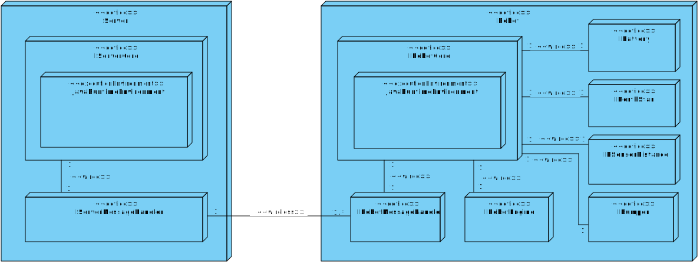

# 4. Produktumgebung

## 4.1 Systemumgebung
Im nachfolgenden Abschnitt werden die bekannten Komponenten des Systems und die  dazugehörigen Schnittstellen beschrieben. Grundsätzlich besteht das System aus mehreren Transportvehikeln, hierfür geeigneten Ladestationen und einem zentralen Server.

### 4.1.1 Hardwareumgebung

#### Server
Es existiert ein zentraler Server. Dieser Server verfügt über ausreichende Ressourcen und ist in der Lage direkt mit den Transportvehikeln zu kommunizieren. Weitere Spezifikationen für den Server existieren nicht.

#### Robot
Das Transportvehikel erfüllt Grundfunktionalitäten wie das Anfahren von Zielen, das Umfahren von Hindernissen und das Laden des Akkumulators. Nachfolgend werden die zentralen Hardwarekomponenten des Transportvehikels beschrieben.

##### IRobotCore
Das Transportvehikel verfügt über einen zentralen Hauptprozessor, über den auf alle weiteren Komponenten zugegriffen werden kann. Dies wird der Einfachheit halber angenommen.

##### IMessageHandler
Mit der Kommunikationseinheit, genannt IMessageHandler, kann das Transportvehikel Nachrichten, die vom zentralen Server für das Vehikel abgesetzt wurden, direkt empfangen. Der Einfachheit wegen wird angenommen, die Komponente ist stets empfangsbereit und die dahinterstehende Infrastruktur zur Übertragung von Nachrichten stabil. Genaue Spezifikationen für die Funktionsweise des Moduls sind nicht bekannt.

##### IRobotEngine
Als Antrieb nutzt das Transportvehikel einen omnidirektionalen Antrieb mit 3 Motoren, über welchen es sich vorwärts, nach rechts, nach links oder durch Drehen um die eigene Achse bewegen lässt. Der Antrieb ermöglich eine Fahrt in verschiedenen Geschwindigkeiten, wobei eine nicht näher spezifizierte Grenze nicht überschritten werden kann.

##### IBattery
Jedes Transportvehikel verfügt über einen Akkumulator, der zur Energieversorgung dient. Eine ausreichende Ladung des Akkumulators ist deshalb zum Betrieb des Vehikels unbedingt erforderlich. Der Akkumulator hat eine maximale Ladekapazität und kann über eine Ladestation geladen werden. Die genaue Beschaffenheit des Akkumulators ist nicht bekannt.

##### INorthStar
Eine Komponente, genannt INorthStar, kann ähnlich einem GPS-Modul die Position des Transportvehikels feststellen. Hierbei ist die Komponente in der Lage, die Koordinaten der Position in einem zweidimensionalen Koodinatensystem und die aktuelle Ausrichtung des Vehikels zu ermitteln.

##### IRSensorDistance
Das Transportvehikel verfügt über 9 Infarotdistanzsensoren, die an der kreisförmigen Außenwand des Vehikels im Abstand von jeweils 40° angeordnet sind. Über sie ist die Feststellung der Entfernung des Vehikels von allen bewegten und unbewegten Objekten in der Umgebung möglich.

##### IBumper
Bei einer Kollision des Transportvehikels mit einem anderen Objekt, stellt das Vehikel dies über die Sensorik eine Kollisionserkennung fest. Hierauf können entsprechende Schritte eingeleitet werden.

#### ChargingStation
Es existieren mehrere Ladestationen, über die sich die Akkumulatoren der Transportvehikel vollständig laden lassen. Eine Ladestation kann dabei maximal ein Vehikel gleichzeitig laden. Die genaue Funktionsweise des Ladevorgangs ist nicht spezifiziert. Jede Ladestation verfügt über eine genaue Position.

### 4.1.2 Softwareumgebung

#### Server
Auf dem Server läuft, da nicht anders angegeben, ein Standard-Betriebssystem. Darauf läuft eine Laufzeitumgebung, die die benötigten Methoden zur Kommunikation mit den Robots bereitstellt. Die wichtigste (und einzige bisher spezifizierte) Methode, ist die CallRobot() Methode um einen Robot anzurufen und einen Datenaustausch herzustellen.

#### Robot
Nachfolgend werden die zentralen Softwareschnittstellen des Transportvehikels beschrieben.

##### IRobotCore
Auf der zentralen Recheneinheit des Robots, dem IRobotCore, läuft eine JavaRuntimeEnvironment, in der sich die gesamte Steuerung und die Verwendung der Komponenten und Schnittstellen abspielt. Die einzelnen Komponenten mit ihren Methoden werden im folgenden näher erläutert.

##### IRSensorDistance
Die IRSensorDistance Komponente stellt drei Methoden bereit, mit denen die Distanz  und der Winkel des entdeckten Objekts und der an der Entdeckung beteiligte Infrarotsensor erfasst und in Arrays gespeichert werden.

##### IDistanceSensor
Die besagten Arrays kann der IDistanceSensor auslesen. Er hat dazu ebenfalls drei Methoden. getIRDistances() gibt ein Array mit allen erfassten Objekten zurück, getIRDistancesInRange() gibt ebenfalls ein Array zurück, das allerdings nur die Objekte in einer gewissen Range enthält und getNearestIRDistances() gibt nur das nächste Objekt zurück.

##### INorthStar
Die Komponente INorthStar ist für die Positionierung zuständig und greift dabei auf ein Device zur Standortbestimmung zurück. Sie hat zwei Methoden. Eine liest die aktuelle Position aus, die andere die aktuelle Ausrichtung. Die Position besteht dabei aus zwei float-Werten, einer x- und einer y-Koordinate.

##### IMessageHandler
Der IMessageHandler ist die Komponente, die eintreffende Anrufe des Servers verarbeitet. Das Verhalten und die enthaltenen Methoden sind dabei allerdings nicht näher spezifiziert. So kann man davon ausgehen, dass jegliche Methoden der anderen Komponenten über den Core aufgerufen und die Ergebnisse an die IMessageHandler Komponente übergeben werden können, damit diese die Informationen auf Anfrage des Servers beschaffen und übermitteln kann.

##### IBumperHandler
Die IBumperHandler ist die Komponente zum Umgang mit Zusammenstößen. Das IBumper Device registriert einen Aufprall und die IBumperHandler Komponente stellt zwei Methoden zum Umgang mit dem Aufprall bereit.

##### IDrive
Die Bewegungssteuerung des Robots heißt IDrive. Sie stellt vier Methoden bereit. Die Methoden driveToPosition() und driveToPositionCautiously() erwarten beide eine Position, eine Geschwindigkeit und einen ArrivalHandler, der eine Methode zur Meldung aufruft, wenn der Roboter am Ziel angekommen ist. Die Methoden sind beide dafür da, ein gegebenes Ziel anzufahren, wobei bei der Zweiten die Höchstgeschwindigkeit geringer ist. Die höchstgeschwindigkeit für Cautiously, Regular und Fast Methoden stellt die IDrive Komponente bereit, wobei Cautiously ≤ Regular ≤ Fast gilt.
Die anderen beiden Methoden, drive() und driveCautiously() unterscheiden sich ebenfalls nur in der Höchstgeschwindigkeit und ermöglichen ein manuelles Fahren. Dabei erwarten sie die Drehung des Roboters als float-Wert sowie die Vorwärts- und die Seitwärtsgeschwindigkeit, ebenfalls als float-Wert.

##### IBattery
Bei IBattery handelt es sich um die Akkusteuerung des Roboters. Sie stellt zwei Methoden bereit. getBatteryLevel() gibt den aktuellen Akkuladestand als float-Wert zurück, getChargingPosition() gibt die Position einer Ladestation zurück.

### 4.1.3 Ressourcenübersicht
In der folenden Übersicht werden die in 4.1.1 und 4.1.2 beschriebenen Komponenten und Schnittstellen im Verteilungsdiagramm dargestellt.

